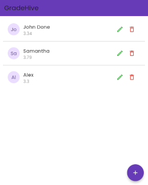
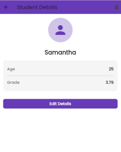

# GradeHive

GradeHive is a lightweight Flutter app that uses **Google Sheets** as a backend database, with **Google Apps Script** providing a RESTful API interface.

## Technology Stack

- **Flutter**: Client-side app for UI and API communication
- **Google Sheets**: Cloud spreadsheet database for student records
- **Google Apps Script**: Backend REST API layer deployed as a Web App

---

## Screenshots




## Script for `code.gs`

```javascript
const SHEET_ID = "";
const SHEET_NAME = "";

function doGet(e) {
  try {
    const sheet = SpreadsheetApp.openById(SHEET_ID).getSheetByName(SHEET_NAME);
    const values = sheet.getDataRange().getValues();
    const data = [];

    // Skip header
    for (let i = 1; i < values.length; i++) {
      const row = values[i];
      data.push({
        id: i, // ID based on row index (used for update/delete)
        name: row[0]?.toString() || "",
        age: parseInt(row[1]) || 0,
        grade: row[2]?.toString() || ""
      });
    }

    return ContentService.createTextOutput(JSON.stringify(data))
      .setMimeType(ContentService.MimeType.JSON);
  } catch (error) {
    return ContentService.createTextOutput(JSON.stringify({ 
      error: error.toString(), 
      message: "Error retrieving data" 
    }))
    .setMimeType(ContentService.MimeType.JSON);
  }
}

function doPost(e) {
  try {
    const action = e.parameter.action;

    switch (action) {
      case "create":
        return createStudent(e);
      case "update":
        return updateStudent(e);
      case "delete":
        return deleteStudent(e);
      default:
        return ContentService.createTextOutput(JSON.stringify({ status: "ERROR", message: "Invalid action" }))
          .setMimeType(ContentService.MimeType.JSON);
    }
  } catch (error) {
    return ContentService.createTextOutput(JSON.stringify({ 
      status: "ERROR", 
      message: error.toString() 
    }))
    .setMimeType(ContentService.MimeType.JSON);
  }
}

function createStudent(e) {
  const name = e.parameter.name || "";
  const age = parseInt(e.parameter.age) || 0;
  const grade = e.parameter.grade || "";

  const sheet = SpreadsheetApp.openById(SHEET_ID).getSheetByName(SHEET_NAME);
  sheet.appendRow([name, age, grade]);

  return ContentService.createTextOutput(JSON.stringify({ status: "SUCCESS", message: "Student created" }))
    .setMimeType(ContentService.MimeType.JSON);
}

function updateStudent(e) {
  const id = parseInt(e.parameter.id); // Row number (starting from 1)
  if (isNaN(id)) {
    return ContentService.createTextOutput(JSON.stringify({ status: "ERROR", message: "Invalid ID" }))
      .setMimeType(ContentService.MimeType.JSON);
  }
  
  const name = e.parameter.name || "";
  const age = parseInt(e.parameter.age) || 0;
  const grade = e.parameter.grade || "";

  const sheet = SpreadsheetApp.openById(SHEET_ID).getSheetByName(SHEET_NAME);
  const rowIndex = id + 1; // Account for header row

  sheet.getRange(rowIndex, 1).setValue(name);
  sheet.getRange(rowIndex, 2).setValue(age);
  sheet.getRange(rowIndex, 3).setValue(grade);

  return ContentService.createTextOutput(JSON.stringify({ status: "SUCCESS", message: "Student updated" }))
    .setMimeType(ContentService.MimeType.JSON);
}

function deleteStudent(e) {
  const id = parseInt(e.parameter.id);
  if (isNaN(id)) {
    return ContentService.createTextOutput(JSON.stringify({ status: "ERROR", message: "Invalid ID" }))
      .setMimeType(ContentService.MimeType.JSON);
  }

  const sheet = SpreadsheetApp.openById(SHEET_ID).getSheetByName(SHEET_NAME);
  const rowIndex = id + 1;

  sheet.deleteRow(rowIndex);

  return ContentService.createTextOutput(JSON.stringify({ status: "SUCCESS", message: "Student deleted" }))
    .setMimeType(ContentService.MimeType.JSON);
}